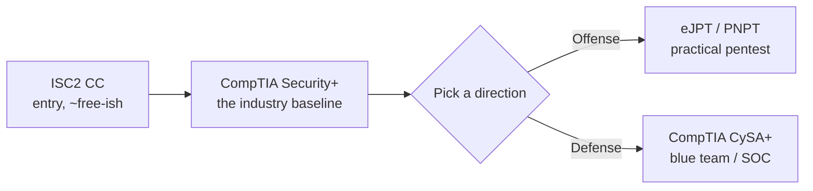

# Certifications — a plan around your AUM discount

Certifications are how you turn "I learned this" into "an employer believes I learned this." As an AUM student you get meaningful discounts — use them **before you graduate**.

!!! warning "Prices & offers change — verify first"
    The numbers below are guidance as of 2026. Always confirm current pricing and student eligibility on the official sites before paying. Check whether **AUM's IT/Computer Science department or careers office** resells vouchers or has an academic partnership — that's often the biggest discount of all, so **ask your professor/advisor**.

## Recommended path

### 1. ISC2 Certified in Cybersecurity (CC) — *start here*
Entry-level, vendor-neutral, well-recognized. ISC2's free "One Million Certified in Cybersecurity" program **closed to new sign-ups in May 2026**, so new candidates now pay the standard fee (~$199). Still a great, low-cost first cert. Self-study with the official materials + Module 4 of this course.
🔗 [isc2.org — Certified in Cybersecurity](https://www.isc2.org/certifications/cc)

### 2. CompTIA Security+ (SY0-701) — *the one that matters most*
The baseline certification most entry-level cybersecurity jobs ask for. **This is your priority.**

- **Study:** Modules 1–5 of this course + **Professor Messer's free SY0-701 videos** and his practice exams.
- **Student discount:** the **CompTIA Academic Store** offers vouchers at a significant discount for verified students (roughly *~$220* vs. the standard *~$439*). Eligibility is verified via **SheerID** using your AUM enrollment document.
  🔗 [How students buy discounted CompTIA vouchers](https://help.comptia.org/hc/en-us/articles/13934022730772)
- Sit the exam online (proctored) or at a test center.

### 3a. Offensive direction — practical pentest certs
If you love Modules 6–7:

- **INE eJPT (eLearnJunior Penetration Tester)** — beginner-friendly, hands-on, affordable.
- **TCM Security PNPT** — a real 5-day exam with a report; matches this course's style closely (Heath Adams teaches the [Module 7 video](modules/07-pentest.md)). TCM often has student/bundle deals.

### 3b. Defensive direction — blue team / SOC
If you love Modules 8–9:

- **CompTIA CySA+** — cybersecurity analyst; also on the academic store with a student discount.

## What to do now

1. **This week:** create your **CompTIA Academic Store** account and verify your AUM student status (do it while enrolled!).
2. **Ask your AUM department** whether they provide or subsidize exam vouchers.
3. **Target:** pass **Security+** within ~2 months of finishing Module 5. That single cert does the most for your employability.

!!! tip "Log it"
    Track your cert goals and dates in your [progress tracker](progress.md).
