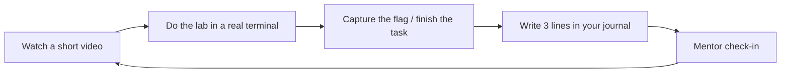

# Chandana's Cyber Path

Welcome, Chandana 👋 This is your personal, hands-on cybersecurity course. It is built for the way *you* learn best: **watch a short video, then immediately do it yourself** in a real terminal.

You are in your final semester of the MS Cybersecurity at AUM. The goal here is not to cram for one more exam — it's to actually *understand* and *be able to do* the things employers (and certifications) expect, using the topics you already saw in your AUM labs as the backbone.

- :material-flag-checkered: **Start here**

    New to this? Read [How this course works](how-it-works.md) and the [16-week roadmap](roadmap.md).

- :material-console: **Get hands-on today**

    [Open your free cloud workspace](setup/codespaces.md), then play the [Bash CTF](ctf/bash-ctf.md).

- :material-school: **Follow the modules**

    Eleven modules, each = curated videos + a practical lab. [See all modules](modules/index.md).

- :material-certificate: **Earn a certification**

    Use your AUM student discount. [Certification plan](certs.md).

!!! tip "How to use this with your mentor (Pranith)"
    Work through one module at a time. After each lab, fill in your [progress tracker](progress.md) and [journal](journal.md), and send Pranith a quick message. He'll review and unblock you.

## The learning loop

